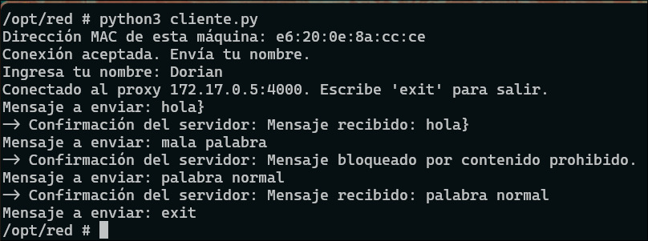
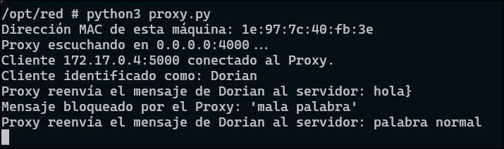
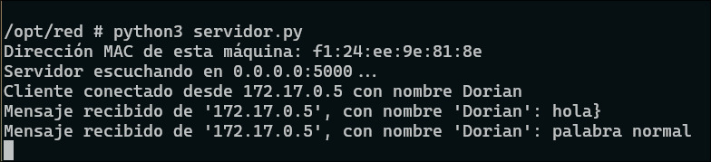
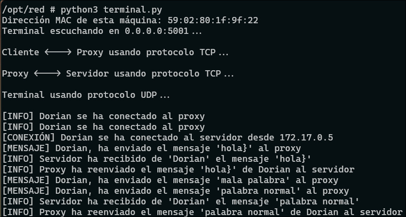

<p align="center">
  <a href="README.md">Español</a> |
  <a href="README.en.md">English</a>
</p>

# Client–Proxy–Server Communication System with Docker

Distributed network system that implements a three-layer communication model using TCP/UDP sockets in Python and Docker. The system enables communication between a client and a server through an intermediary proxy that applies security filters and traffic control, while a centralized terminal monitors all activities in real time.

## 📋 Table of Contents

- [General Description](#general-description)
- [System Architecture](#system-architecture)
- [Features](#features)
- [Technologies Used](#technologies-used)
- [Prerequisites](#prerequisites)
- [Installation](#installation)
- [Usage](#usage)
- [Project Structure](#project-structure)
- [Detailed Operation](#detailed-operation)
- [Screenshots](#screenshots)
- [OSI Model](#osi-model)
- [Contributions](#contributions)

## 🎯 General Description

This project implements a network communication system that simulates a real enterprise environment where client messages pass through a proxy system for content filtering and security control before reaching the server. All network traffic is monitored by a centralized terminal that logs every operation.

### Communication Flow

Client → Proxy → Server
↓ ↓ ↓
└────→ Terminal ←┘


**Step-by-step process:**
1. The **Client** sends a message to the **Proxy**
2. The **Proxy** filters the message using:
   - Forbidden words filter
   - Port control firewall
3. If the message passes the filters, it is forwarded to the **Server**
4. The **Server** processes the message and sends a confirmation
5. The **Proxy** returns the confirmation to the **Client**
6. All components send logs to the **Terminal** for real-time monitoring

## 🏗️ System Architecture
### Components

| Component | IP | Port | Protocol | Function |
|---------|------------|------|----------|---------|
| **Terminal** | 172.17.0.2 | 5001 | UDP | Centralized event monitoring |
| **Server** | 172.17.0.3 | 5000 | TCP | Processes messages |
| **Proxy** | 172.17.0.5 | 4000 | TCP | Content filtering and access control |
| **Client** | Variable | 5000 | TCP | Sends messages |

### Network Diagram

```
┌──────────────┐
│   Terminal   │ ← Gets UDP logs from all components
│  172.17.0.2  │
│   Port   5001│
└──────────────┘
       ↑
       │ (UDP logs)
       │
┌──────┴───────────────────┬─────────────────────┐
│                          │                     │
┌──────────────┐  TCP   ┌──────────────┐  TCP  ┌──────────────┐
│   Client     │───────→│    Proxy     │──────→│   Server     │
│  Variable IP │        │ 172.17.0.5   │       │ 172.17.0.3   │
│  Port  5000  │←───────│ Port  4000   │←──────│ Port  5000   │
└──────────────┘        └──────────────┘       └──────────────┘
```

## 📸 Screenshots

### Client


### Proxy


### Server


### Terminal


## ✨ Features

### 🔒 Security
- **Content filtering** for forbidden words
- **Port firewall** (port 6000 blocked)
- **Access control** validation

### 🔍 Monitoring
- **Centralized terminal**
- **End-to-end message tracking**
- **Client identification via MAC address**

### 🌐 Networking
- **TCP communication**
- **UDP logging**
- **MAC-based identification**

## 🛠️ Technologies Used

- Python 3.x
- Python Socket Programming
- Docker
- TCP/IP
- UDP
- UUID (MAC address identification)

## 📦 Prerequisites

- Docker
- Docker Compose (optional)
- Python 3.x (for local execution)
- Basic networking knowledge

## 🚀 Installation

### Option 1: Docker (Recommended)

```bash
git clone https://github.com/your-username/client-proxy-server-system.git
cd client-proxy-server-system

Build images:

docker build -t network-terminal ./terminal
docker build -t network-server ./server
docker build -t network-proxy ./proxy
docker build -t network-client ./client

Create network:

docker network create --subnet=172.17.0.0/16 project-network

💻 Usage
Docker Execution Order

    Terminal

    Server

    Proxy

    Client

Local Execution
Local Execution
python3 terminal.py
python3 server.py
python3 proxy.py
python3 client.py 172.17.0.5

📁 Project Structure

(Same structure as Spanish README)

🔧 Detailed Operation

Each component follows the same logic described in the Spanish documentation, translated and adapted for clarity in English environments.

🌐 OSI Model

This project implements layers 1, 2, 3, 4 and 7 of the OSI model using Docker networking and Python sockets.

🤝 Contributions

Fork the project

Create a feature branch

Commit changes

Push to your branch

Open a Pull Request

📝 License

MIT License. See LICENSE file.

👨‍💻 Author

Educational project demonstrating:

Python socket programming

Network architecture

Docker containerization

OSI model

Distributed systems


---
